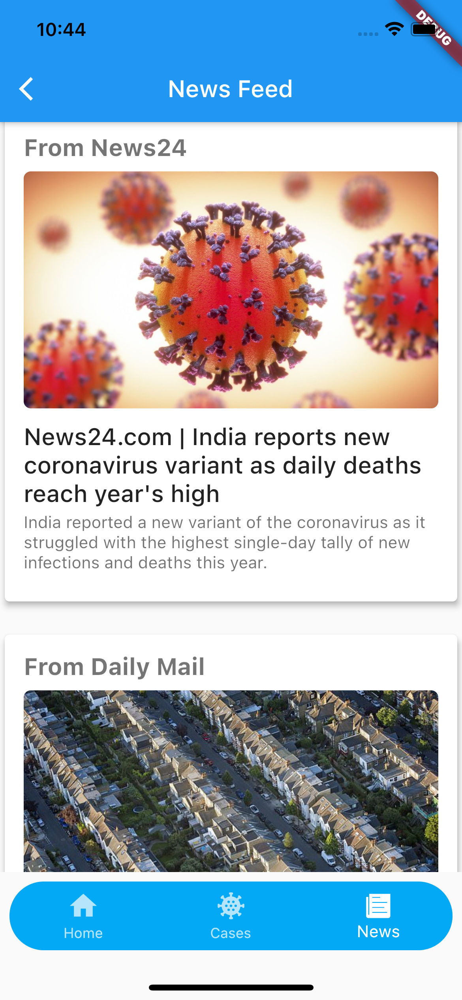

# Covid-19 Tracker

A Flutter Application that tracks cases around the world.

## Getting Started

A few resources used in this project:

- [Covid -19 API](https://coronavirus-19-api.herokuapp.com/countries)
- [News API](https://newsapi.org/)  

   

> Note : use your own API key 

 
App State is managed using [Provider Package](https://pub.dev/packages/provider)  
  

### <u>Home Screen</u>

    

### <u>Pie Chart Screen</u>
  
    

### <u>Cases Screen</u>

    

### <u>News Screen</u>

